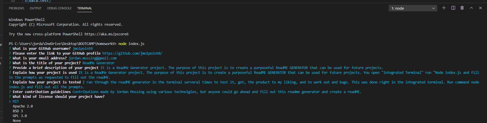

# Project Title: ReadME Generator

## Description: It is a ReadMe Generator project. The purpose of this project is to create a purposeful ReadME GENERATOR that can be used for future projects.

# Table of Contents:
*[Installation](#installation)
*[Usage](#usage)
*[License](#license)
*[Contributions](#contribution)
*[Test](#test)
*[Questions](#questions)

## [GitHub Link](http://github.com/jmo1point0)

** [GitHub Profile](https://github.com/jmo1point0/) **

## Installation:
 undefined    

 ## Usage:
 It is a ReadMe Generator project. The purpose of this project is to create a purposeful ReadME GENERATOR that can be used for future projects. You open "integrated Terminal" run "Node index.js and fill in the prompts as requested to fill out the readME.

 ## License:
 

 ## Contributing:
 Contributions made by Jordan Mossing using various technolgies, but anyone could go ahead and fill out this readme generator and create a readME file in the future for future projects. 

 ## Test:
 I ran through the readME generator in the terminal serveral times to test it, get the product to my liking, and to work out and bugs. This was done right in the integrated terminal. Run command node index.js and fill out all the prompts.

 ## Questions:
 
Reach out to me on my GitHub page at the following Link:
 -[GitHub Profile](https://github.com/jmo1point0)    
 Or by email: jordan.mossing@gmail.com
 
 # 

 # 

 # [Vimeo Link](https://vimeo.com/513644649/719843b682) 
 # Description: A link to a brief walkthrough video that demonstrates the functionality of the README generator, which will take you from start to finish. 

